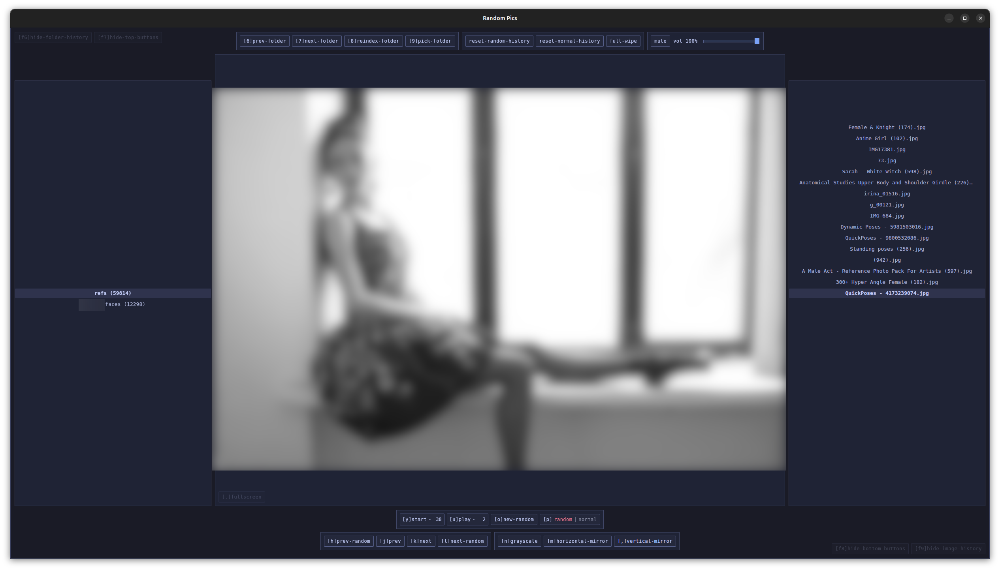

## random-pics
Fast desktop local image viewer for gesture drawing and reference practice.
If you touch-type, the UI shortcuts should feel natural on first use.



## what it does
- opens large image folders quickly, works natively with nested folders (folders inside folders)
- lets you browse in order or shuffle randomly
- **Ctrl** toggles shortcut hints, **Alt** switches left/right key side; button order updates to match keyboard rows
- includes a timed slideshow mode for hands-free practice
- remembers your last image and UI settings between launches
- offers quick image aids: mirror and greyscale
- keeps session history so you can jump back easily

## additional shortcuts
- hold **z** or **/** key, enter number of seconds, release key to update start/stop timer value

## install

Debian/Ubuntu via apt repository:
```bash
curl -fsSL https://yukiyuziriha.github.io/random-pics/apt/keyrings/random-pics-archive-keyring.gpg \
  | sudo tee /usr/share/keyrings/random-pics-archive-keyring.gpg >/dev/null
echo "deb [signed-by=/usr/share/keyrings/random-pics-archive-keyring.gpg] https://yukiyuziriha.github.io/random-pics/apt stable main" \
  | sudo tee /etc/apt/sources.list.d/random-pics.list >/dev/null
sudo apt update
sudo apt install -y random-pics
```

Debian/Ubuntu one-off install from latest release asset:
```bash
bash <(curl -fsSL https://raw.githubusercontent.com/YukiYuziriha/random-pics/main/scripts/install-latest-deb.sh)
```

Arch via AUR (once `random-pics-bin` is published):
```bash
yay -S random-pics-bin
```

Arch direct from AppImage release asset:
```bash
chmod +x ./random-pics_1.1.0_amd64.AppImage
./random-pics_1.1.0_amd64.AppImage
```

Run installed app:
```bash
random-pics
```

## dev run
Requirements:
- Bun
- Rust toolchain (for Tauri)

Command (safe on fresh shells):
```bash
source "$HOME/.cargo/env" && bunx tauri dev
```

If Rust is already on PATH:
```bash
bunx tauri dev
```

What this does:
- starts frontend watch build
- runs Tauri desktop app with bundled local frontend assets
- uses Rust Tauri commands (`invoke`) for backend logic
- does not require localhost HTTP API

## typecheck / test
Typecheck:
```bash
bun tsc
```

Rust backend regression tests:
```bash
bun run test
```

CI-style validation (Rust tests + TypeScript typecheck):
```bash
bun run test:ci
```

## build app package
```bash
source "$HOME/.cargo/env" && bunx tauri build
```

Output files are generated per platform in:
`src-tauri/target/release/bundle/`

Typical outputs include `.deb`/`.AppImage` on Linux, `.dmg` on macOS, and `.msi` on Windows.


## change workflow (important)
If you change `src/App.tsx` (or any frontend file):
- rebuild with `bunx tauri build` and reinstall the generated package for your OS

If you change backend behavior, update Rust code in:
- `src-tauri/src/*.rs`
- `src-tauri/tauri.conf.json`
- `src-tauri/capabilities/*.json`

Current runtime architecture:
- desktop app powered by Tauri commands (`invoke`) for backend logic
- frontend assets are bundled into the app package
- no separate local API server required at runtime
