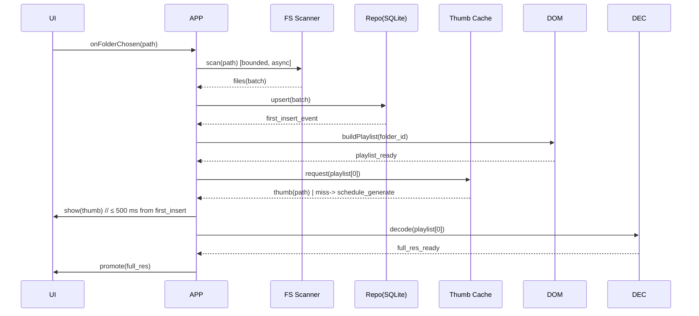
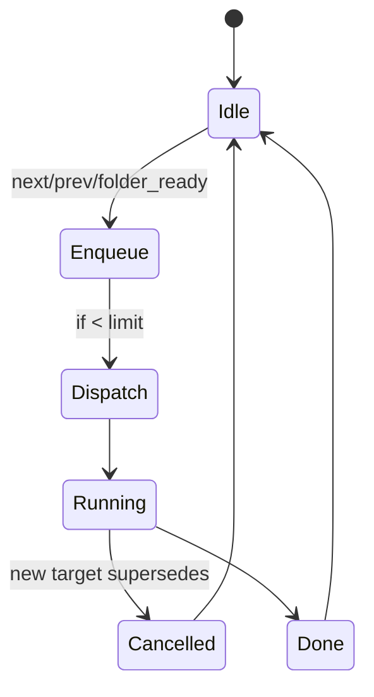

# ARCHITECTURE-IMPROVED.md

> Purpose: A pragmatic, rebuild-ready architecture for the offline, timer‑driven image reference app. This document converts prior RCA + plans into a concrete, implementable design with strict boundaries, a deterministic folder‑switch bootstrap, and guardrails to prevent the known bug class from returning.

---

## 1) Executive Summary
- **North Star KPI:** *First image visible ≤ **500 ms** after the first DB insert on folder switch, without freezing the UI.*
- **Core move:** Separate **Domain** (pure logic) from **App** (orchestration) from **Adapters** (Qt/DB/FS). UI never touches IO directly; all side‑effects live behind ports.
- **Hot paths hardened:** Playlist construction, preloading/decoding, and folder‑switch bootstrap are designed as **deterministic state machines** with explicit gating and bounded work queues.
- **DB model normalized:** `folders` table + `images.folder_id` (no path prefix queries). Thumbnails are mandatory for instant first paint.
- **Observability from day one:** folder‑switch timeline, preload queue metrics, decode latencies, cache hit rate.

---

## 2) Assumptions & Constraints
**Assumptions —**
- Local desktop app (Python + PySide6/Qt). No network.
- SQLite with WAL. Large folders (10k–100k files) are common.
- JPEG/PNG/WebP images; optional EXIF.
- Thumbnails precomputed (or lazily generated once and cached on disk).

**Constraints —**
- Qt thread‑affinity: UI work (QPixmap/QImage creation & assignment) is **main thread only**.
- Resource budgets (typical laptop): keep resident memory under ~350 MB at 20k images; CPU spikes are short (<200 ms bursts).

---

## 3) Target Architecture (Clean, Layered)

```mermaid
flowchart LR
  UI[Qt UI (Views/Signals)] --> APP[Application Service]
  APP <--> DOM[Domain (Pure Logic)]
  APP <--> PORTS{{Ports / Interfaces}}
  PORTS <--> DB[(SQLite Repo)]
  PORTS <--> FS[Filesystem Scanner]
  PORTS <--> THUMB[Thumbnail Cache]
  PORTS <--> DEC[Decoder Pool]
  PORTS <--> CLK[Clock/Timer]
```

**Responsibilities**
- **Domain:** playlist rules, selection, state machines, invariants. No IO.
- **Application:** orchestrates flows; coordinates ports; enforces gating/transactions.
- **Adapters:** actual implementations for DB/FS/Decoder/Clock/Thumbs; all replaceable.

---

## 4) Folder‑Switch Bootstrap (Deterministic)

**Goal:** Selecting a new folder yields a visible image quickly, without races between indexer, playlist, preloader, and UI.



**Rules**
- **Gate UI consume** until `playlist_ready`. No UI pulls directly from DB.
- **First paint is thumbnail**; full decode promotes when ready.
- **Indexing is incremental**; playlist rebuilds are idempotent and cheap.

---

## 5) Data Model (Normalized, Indexed)

```text
folders (
  id INTEGER PRIMARY KEY,
  abs_path TEXT NOT NULL UNIQUE, -- normalized, lowercase on case-insensitive OS
  added_at DATETIME NOT NULL
)

images (
  id INTEGER PRIMARY KEY,
  folder_id INTEGER NOT NULL REFERENCES folders(id) ON DELETE CASCADE,
  rel_path TEXT NOT NULL,          -- path relative to folder
  abs_path TEXT NOT NULL UNIQUE,   -- convenience, but folder_id is master scope
  hash TEXT,                       -- content hash (optional)
  width INTEGER, height INTEGER,
  exif_datetime DATETIME,
  timer_override_seconds INTEGER,  -- per-image override
  added_at DATETIME NOT NULL,
  last_seen_at DATETIME
)

CREATE INDEX idx_images_folder ON images(folder_id);
CREATE INDEX idx_images_folder_rel ON images(folder_id, rel_path);
CREATE INDEX idx_images_last_seen ON images(last_seen_at);
```

**Why IDs not `LIKE 'prefix%'`:** stability, planner efficiency, no path case/sep issues, fast joins, and clear foreign keys.

---

## 6) Core Domain Concepts

- **Playlist:** an ordered list of `image_id`s with a cursor; produced by rules (e.g., shuffle, last‑seen). Pure function of `folder_id` + options.
- **Preloader:** bounded work queue keyed by target image IDs; LIFO discipline for snappy next/prev; cancellation by key.
- **Timers:** driven by a pure state machine (start → running → paused → elapsed), APP listens and schedules.
- **Invariants:** no UI reads DB directly; domain never blocks; every adapter call is cancellable.

---

## 7) Ports (Interfaces) — Sketches

```py
# domain/ports.py
from typing import Iterable, Optional, Protocol
from dataclasses import dataclass

@dataclass(frozen=True)
class ImageMeta:
    id: int
    folder_id: int
    rel_path: str
    width: int | None
    height: int | None
    timer_override_seconds: int | None

class Repo(Protocol):
    def upsert_folder(self, abs_path: str) -> int: ...
    def upsert_images(self, folder_id: int, rel_paths: Iterable[str]) -> None: ...
    def images_in_folder(self, folder_id: int) -> Iterable[ImageMeta]: ...

class ThumbCache(Protocol):
    def get(self, image_id: int) -> Optional[bytes]: ...
    def ensure(self, image_id: int, abs_path: str) -> bytes: ...  # generate if missing

class Decoder(Protocol):
    def decode_async(self, image_id: int, abs_path: str, cb: callable[[int, bytes], None]) -> None: ...

class Clock(Protocol):
    def now(self) -> float: ...
```

---

## 8) Application Orchestration — Key Use Cases

**Use Case A — Folder Switch**
1. `on_folder_chosen(abs_path)`
2. `repo.upsert_folder(abs_path)` → `folder_id`
3. FS scan in batches → `repo.upsert_images(folder_id, rel_paths)` (async)
4. On first insert: `playlist = dom.build_playlist(folder_id, opts)`
5. Request thumb for `playlist[0]` → show immediately; schedule full decode.

**Use Case B — Next/Prev**
- Move cursor, enqueue preloader for new target(s) with **LIFO**; cancel irrelevant in‑flight.

**Use Case C — Timer Elapse**
- On tick, if elapsed and `auto_advance` enabled → Next flow; otherwise wait.

---

## 9) Concurrency & Queues (Deterministic, Bounded)



**Policies**
- **Bounded in‑flight** decodes ≤ N (e.g., 2–4).
- **LIFO** for user navigation; **FIFO** within same target burst.
- **Cancellation tokens** per image_id; best‑effort cancel at adapter.
- **Main‑thread rule:** only promote QPixmap on UI thread.

---

## 10) Thumbnails (Mandatory First Paint)

- Cache directory: `thumbnails/<image_id>.jpg` (fixed edge, e.g., 512 px; JPEG quality ~80).
- Generation: synchronous when first needed, but **off UI thread**; store bytes and return handle.
- Promote policy: always show thumb within the KPI window; later swap to full decode.
- Metrics: hit rate, gen latency, bytes written.

---

## 11) Error Handling & Observability

**Taxonomy**
- DomainError (logic/invariant) vs InfraError (IO/DB/Decode) vs UsageError (bad input).

**Logs & Metrics** (emit from APP)
- `folder_switch.started/first_insert/playlist_ready/first_paint` (timestamps)
- `preloader.inflight`, `preloader.cancelled`, `decode.ms`, `thumb.hit/miss`
- `ui.promote.ms_since_first_insert`

**Tracing**
- Correlate a single folder‑switch with a GUID across scanner → repo → playlist → thumb → UI.

---

## 12) Testing Strategy

- **Unit (Domain):** playlist rules, cursor movement, timer state machine, invariant checks.
- **Contract (Ports):** a shared test suite that any Repo/Thumb/Decoder adapter must pass.
- **Integration:** SQLite with WAL against real schema; scan a temp folder; preload a few images.
- **E2E (Happy path):** folder switch → first paint ≤500 ms; next/prev snappiness; timer auto‑advance.
- **E2E (Failure path):** corrupt image → graceful skip; missing thumb → regen; decode cancel.

---

## 13) The Known Bug Class — Why It Was Hard

**Symptom**: Folder switch sometimes freezes UI or delays first image; races between playlist, preloader, and display; initial frame starved.

**Why hard in old design**
1. **Coupling:** UI pulled from DB/async work without a stable ready signal → nondeterministic order.
2. **Unbounded work:** scans/decodes started without queue discipline → in‑flight storm, contention.
3. **Qt thread misuse:** promotion off the main thread or blocking UI waiting for IO.
4. **Path‑prefix scoping:** slow and fragile for large sets → delays initial results.

**Preventions (Rebuild)**
- **(A) Gating & Signals:** UI renders only after `playlist_ready`; first paint is **thumb**; full decode is opportunistic.
- **(B) Bounded, cancellable queues:** LIFO preloader with per‑item tokens; latest wins.
- **(C) Strict thread‑affinity adapter:** enforce main‑thread promotion; assert if violated.
- **(D) Normalized DB:** `folder_id` scoping; fast first `SELECT` for playlist seed.
- **(E) Telemetry:** measure the folder‑switch timeline; regressions are obvious.

---

## 14) Work Plan (Phased)

**Phase 1 — Domain & UI shell (no DB)**
- Build playlist+timer state machines; wire UI to a fake repo returning a small list.
- Implement preloader queue + cancellation; stub decoder/thumbnail adapters.
- KPI: next/prev snappy; timer elapse advances; first paint of fake data < 200 ms.

**Phase 2 — SQLite & Scanner**
- Add schema and real repo; implement scanner batches; incremental inserts.
- Build `buildPlaylist(folder_id, opts)`; wire gating events.
- KPI: first paint ≤ 500 ms after first insert on a 10k‑image folder.

**Phase 3 — Thumbnails & Decoding Pool**
- Real thumbnail cache; decoder thread pool; main‑thread promotion adapter.
- KPI: thumb hit rate ≥ 90% for revisits; decode latency p95 < 200 ms for 2k px edge.

**Phase 4 — Observability & Hardening**
- Emit metrics; add contract tests; handle corrupt images; backoff on IO errors.
- KPI: zero UI freezes in 30 min stress (rapid folder switches, next/prev spam).

---

## 15) Packaging & Config

- **Config:** 12‑factor style via env or `settings.toml` (thumb size, preloader limits, DB path).
- **Packaging:** PyInstaller one‑file/one‑dir; include VC++/Qt runtimes as needed; test on clean VM.
- **Profiles:** `DEV` (debug logs, asserts), `PROD` (info logs, metrics only).

---

## 16) Checklists

**Folder Switch Done When**
- [ ] First paint (thumb) ≤ 500 ms after first insert
- [ ] UI remains responsive (no spinner > 100 ms)
- [ ] Playlist ready before any UI consume
- [ ] In‑flight decodes ≤ N, latest target wins

**Preloader**
- [ ] LIFO discipline implemented
- [ ] Per‑item cancellation tokens
- [ ] Metrics exported (in‑flight, cancelled, ms)

**Threading**
- [ ] All QPixmap promotions audited to main thread
- [ ] Blocking IO kept off main thread

**DB**
- [ ] `folders` and `images` created with indexes
- [ ] No `LIKE 'prefix%'` queries for scoping

---

## 17) Minimal Skeletons (Illustrative)

```py
# app/service.py
class AppService:
    def __init__(self, repo: Repo, thumbs: ThumbCache, dec: Decoder, clock: Clock):
        ...
    def on_folder_chosen(self, abs_path: str) -> None: ...
    def on_next(self) -> None: ...
    def on_prev(self) -> None: ...
    def on_timer_tick(self) -> None: ...
```

```py
# domain/playlist.py
@dataclass
class Playlist:
    ids: list[int]
    cursor: int = 0
    def current(self) -> int: ...
    def next(self) -> int: ...
    def prev(self) -> int: ...
```

```py
# adapters/preloader.py
class Preloader:
    def __init__(self, decoder: Decoder, limit: int = 3): ...
    def target(self, image_id: int, abs_path: str) -> None:  # LIFO, cancel previous
        ...
```

---

## 18) Future Enhancements (Non‑Blocking)
- Ratings/tags persisted to DB; smart playlists.
- Multi‑folder virtual collections via join tables.
- GPU‑assisted decode for giant images; progressive JPEG handling.
- Crash‑safe thumbnail writes (temp → atomic rename).

---

### Final Note
If you stick to the boundaries, gating, and queues exactly as specified, the original freeze/race class has nowhere to hide. Start with Phase 1, prove snappiness with fake data, then add reality one port at a time.

